# Анализ сложности ребусов

Проект посвящен разработке и исследованию ML-модели, которая предсказывает сложность ребуса по его содержанию: правильному ответу, текстовому описанию логики ребуса и изображению. Задача решается как регрессия: модель должна предсказать числовой таргет `difficulty`.

Был взят реальный датасет из "Переавтобуса" - экосистемы, объединяющей в себе сайт для решения ребусов и интеллектуальных задач.

Ключевое ограничение проекта: поведенческие статистики прохождения ребусов нельзя использовать как признаки модели, потому что `difficulty` вычисляется напрямую через эти статистики. Поэтому модель обучается только на содержательных признаках ребуса: `answer`, `description` и признаках изображения, извлеченных через EfficientNet.

## Содержание

- [Цель проекта](#цель-проекта)
- [Постановка задачи](#постановка-задачи)
- [Данные](#данные)
- [Формула сложности и запрет leakage-признаков](#формула-сложности-и-запрет-leakage-признаков)
- [Структура проекта](#структура-проекта)
- [Установка и запуск](#установка-и-запуск)
- [Предобработка и feature engineering](#предобработка-и-feature-engineering)
- [EDA](#eda)
- [Моделирование](#моделирование)
- [Оценка качества](#оценка-качества)
- [Подбор гиперпараметров](#подбор-гиперпараметров)
- [Интерпретация модели](#интерпретация-модели)
- [Проверка гипотез](#проверка-гипотез)
- [Сохранение модели](#сохранение-модели)
- [Соответствие ТЗ](#соответствие-тз)
- [Ограничения и дальнейшее развитие](#ограничения-и-дальнейшее-развитие)

## Цель проекта

Цель: построить и обосновать модель машинного обучения для предсказания сложности ребуса по данным, доступным до накопления статистики прохождения.

Полный ML-цикл в проекте:

```text
Data -> Preprocessing -> Feature Engineering -> Model -> Evaluation -> Interpretation -> Saving
```

Что сделано:

- загружен и описан реальный датасет с ребусами;
- проверена формула расчета `difficulty`;
- определены и исключены leakage-признаки;
- проведен EDA с распределениями, корреляциями и выводами;
- построены несколько групп признаков: `answer`, `answer + description`, NLP, EfficientNet;
- обучены baseline, классические ML-модели и ансамбли;
- посчитаны метрики регрессии `MAE`, `RMSE`, `R2`;
- выполнен подбор гиперпараметров;
- проведена интерпретация через permutation importance;
- проверены гипотезы;
- сохранена итоговая модель.

Предметная область: IT / цифровые продукты, текстово-визуальные данные и пользовательские задания.

## Постановка задачи

Тип задачи: **регрессия**.

Целевая переменная:

```text
difficulty
```

Разрешенные источники признаков:

- `answer` - правильный ответ или варианты ответа;
- `description` - текстовое описание логики ребуса;
- `img_url` - путь к изображению ребуса;
- `effnet_feat_*` - признаки изображения, извлеченные через EfficientNet-B0.

Запрещенные признаки:

- `started`;
- `solved`;
- `users_with_hints`;
- `total_hints`;
- `solve_rate`;
- `hint_usage`;
- `avg_hints`.

Эти признаки запрещены, потому что они либо входят в формулу `difficulty`, либо являются производными от колонок формулы.

## Данные

Основные файлы данных:

| Файл | Назначение |
|---|---|
| `data.csv` | исходный датасет с ответами, описаниями, путями к изображениям, статистиками прохождения и `difficulty` |
| `data_with_efficientnet_features.csv` | расширенный датасет с 1280 признаками `effnet_feat_*` |
| `images/daily-rebuses/` | локальная папка с изображениями ребусов |
| `images/README.md` | описание правил сопоставления `img_url` с локальными файлами |

Основные поля исходного датасета:

| Поле | Роль в проекте |
|---|---|
| `answer` | разрешенный текстовый источник признаков |
| `description` | разрешенный текстовый источник признаков |
| `img_url` | путь к изображению, используется для извлечения EfficientNet-признаков |
| `difficulty` | target |
| `started`, `solved`, `users_with_hints`, `total_hints` | только для проверки формулы target, не для обучения |
| `solve_rate`, `hint_usage`, `avg_hints` | leakage-производные, не для обучения |

Пример загрузки данных:

```python
from pathlib import Path

import pandas as pd

DATA_PATH = Path("data.csv")
df = pd.read_csv(DATA_PATH)

print(df.shape)
print(df[["answer", "description", "img_url", "difficulty"]].head())
```

Для финальных экспериментов с изображениями используется файл `data_with_efficientnet_features.csv`:

```python
from pathlib import Path

import pandas as pd

DATA_PATH = Path("data_with_efficientnet_features.csv")
df = pd.read_csv(DATA_PATH)

effnet_columns = [column for column in df.columns if column.startswith("effnet_feat_")]

print(f"Всего строк: {len(df)}")
print(f"EfficientNet-признаков: {len(effnet_columns)}")
```

## Формула сложности и запрет leakage-признаков

Сложность ребуса в данных вычисляется по формуле:

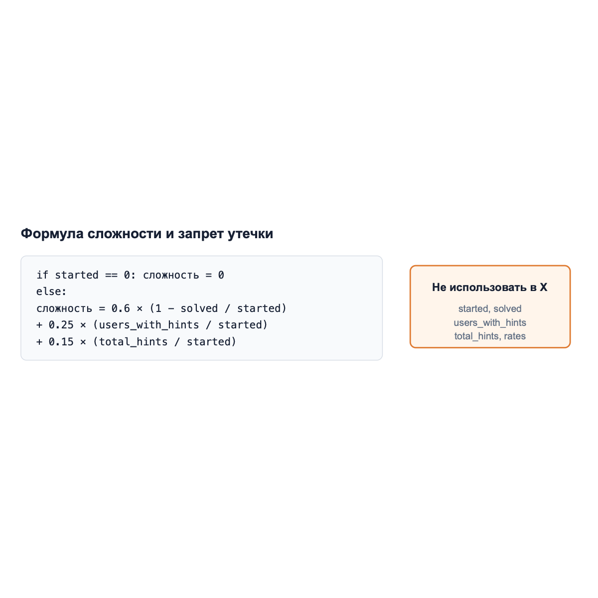

Формула:

```text
если started == 0:
    difficulty = 0
иначе:
    difficulty = 0.6 * (1 - solved / started)
               + 0.25 * (users_with_hints / started)
               + 0.15 * (total_hints / started)
```

Код расчета:

```python
import numpy as np
import pandas as pd


def calculate_difficulty(frame: pd.DataFrame) -> pd.Series:
    started = frame["started"].replace(0, np.nan)
    calculated = (
        0.6 * (1 - frame["solved"] / started)
        + 0.25 * (frame["users_with_hints"] / started)
        + 0.15 * (frame["total_hints"] / started)
    )
    return calculated.fillna(0)
```

Код проверки формулы:

```python
FORMULA_COLUMNS = [
    "started",
    "solved",
    "users_with_hints",
    "total_hints",
]

TARGET = "difficulty"


def validate_difficulty_formula(frame: pd.DataFrame) -> pd.DataFrame:
    check = frame[[TARGET, *FORMULA_COLUMNS]].copy()
    check["difficulty_calculated"] = calculate_difficulty(frame)
    check["absolute_diff"] = (
        check[TARGET] - check["difficulty_calculated"]
    ).abs()
    return check


formula_check = validate_difficulty_formula(df)

print(formula_check["absolute_diff"].max())
print(formula_check["absolute_diff"].mean())
```

В текущих данных расхождение между `difficulty` и пересчитанной формулой очень маленькое и объясняется округлением:

```text
max absolute diff: 0.00004981
mean absolute diff: 0.00002555
```

Проверка запрета leakage-признаков:

```python
LEAKAGE_COLUMNS = [
    "started",
    "solved",
    "users_with_hints",
    "total_hints",
    "solve_rate",
    "hint_usage",
    "avg_hints",
]


def validate_no_leakage(feature_names):
    leakage = sorted(set(feature_names) & set(LEAKAGE_COLUMNS))
    if leakage:
        raise ValueError(
            f"Leakage columns are not allowed as model features: {leakage}"
        )
```

Почему это важно: если обучать модель на `started`, `solved`, `users_with_hints`, `total_hints`, она будет восстанавливать известную формулу, а не предсказывать сложность по самому ребусу.

## Структура проекта

```text
.
├── data.csv
├── data_with_efficientnet_features.csv
├── extract_efficientnet_features.py
├── requirements.txt
├── README.md
├── images/
│   ├── README.md
│   └── daily-rebuses/
├── models/
│   ├── best_text_efficientnet_model.joblib
│   └── best_text_efficientnet_model_metadata.csv
├── notebooks/
│   ├── 00_data_eda_preprocessing.ipynb
│   ├── 01_answer_features_training.ipynb
│   ├── 02_answer_description_features_training.ipynb
│   ├── 03_nlp_text_features_training.ipynb
│   ├── 04_efficientnet_features_training.ipynb
│   ├── 05_best_text_plus_efficientnet_training.ipynb
│   ├── 06_approaches_metrics_report.ipynb
│   ├── 07_hyperparameter_tuning_interpretation_saving.ipynb
│   └── 08_hypothesis_testing.ipynb
├── presentation/
│   ├── project_presentation.md
│   └── assets/
├── reports/
│   ├── all_model_metrics.csv
│   └── best_model_by_approach.csv
└── src/
    └── puzzle_difficulty/
        ├── constants.py
        ├── features.py
        └── modeling.py
```

Назначение ноутбуков:

| Ноутбук | Назначение |
|---|---|
| `00_data_eda_preprocessing.ipynb` | загрузка данных, формула сложности, leakage, EDA, базовая предобработка |
| `01_answer_features_training.ipynb` | обучение моделей только на признаках из `answer` |
| `02_answer_description_features_training.ipynb` | обучение на признаках из `answer + description` |
| `03_nlp_text_features_training.ipynb` | NLP-подход: лемматизация, TF-IDF, char n-grams |
| `04_efficientnet_features_training.ipynb` | обучение только на EfficientNet-признаках, без `answer` и `description` |
| `05_best_text_plus_efficientnet_training.ipynb` | объединение лучшего текстового подхода с EfficientNet |
| `06_approaches_metrics_report.ipynb` | сводные метрики, сравнительные таблицы и графики |
| `07_hyperparameter_tuning_interpretation_saving.ipynb` | `GridSearchCV`, permutation importance, сохранение модели |
| `08_hypothesis_testing.ipynb` | проверка гипотез по разрешенным признакам |

Переиспользуемые модули:

| Файл | Назначение |
|---|---|
| `src/puzzle_difficulty/constants.py` | константы проекта: target, leakage-колонки, formula columns, random state |
| `src/puzzle_difficulty/features.py` | формула сложности, проверка leakage, текстовые и NLP-признаки |
| `src/puzzle_difficulty/modeling.py` | модели, пайплайны, метрики и кросс-валидация |
| `extract_efficientnet_features.py` | извлечение EfficientNet-B0 признаков из изображений |


## Предобработка и feature engineering

### Подход 1: только `answer`

Из `answer` создаются числовые признаки:

- длина ответа в символах;
- число слов;
- средняя длина слова;
- число гласных;
- число согласных;
- число редких букв;
- число уникальных символов;
- доля гласных;
- доля редких букв;
- доля уникальных символов;
- доля кириллических и латинских букв;
- наличие дефиса;
- наличие цифр.

Код:

```python
import pandas as pd

VOWELS = set("аеёиоуыэюя")
RARE_LETTERS = set("фщъёцэ")


def first_answer_variant(answer: object) -> str:
    if pd.isna(answer):
        return ""
    return str(answer).split("|")[0].strip()


def extract_text_stats(text: object, prefix: str = "") -> pd.Series:
    if pd.isna(text):
        text = ""

    normalized = first_answer_variant(text).lower()
    compact = normalized.replace(" ", "")
    words = [word for word in normalized.split() if word]

    letters = [char for char in compact if char.isalpha()]
    cyrillic_letters = [
        char for char in letters if "а" <= char <= "я" or char == "ё"
    ]
    latin_letters = [char for char in letters if "a" <= char <= "z"]

    len_chars = len(compact)
    vowel_count = sum(char in VOWELS for char in compact)
    consonant_count = sum(char.isalpha() and char not in VOWELS for char in compact)
    rare_count = sum(char in RARE_LETTERS for char in compact)
    unique_chars = len(set(compact))

    return pd.Series(
        {
            f"{prefix}len_chars": len_chars,
            f"{prefix}len_words": len(words),
            f"{prefix}avg_word_len": len_chars / len(words) if words else 0.0,
            f"{prefix}vowel_count": vowel_count,
            f"{prefix}consonant_count": consonant_count,
            f"{prefix}rare_count": rare_count,
            f"{prefix}unique_chars": unique_chars,
            f"{prefix}vowel_ratio": vowel_count / len_chars if len_chars else 0.0,
            f"{prefix}rare_ratio": rare_count / len_chars if len_chars else 0.0,
            f"{prefix}unique_ratio": unique_chars / len_chars if len_chars else 0.0,
            f"{prefix}cyrillic_ratio": len(cyrillic_letters) / len(letters) if letters else 0.0,
            f"{prefix}latin_ratio": len(latin_letters) / len(letters) if letters else 0.0,
            f"{prefix}has_dash": int("-" in normalized),
            f"{prefix}has_digits": int(any(char.isdigit() for char in normalized)),
        }
    )


def make_answer_features(frame: pd.DataFrame) -> pd.DataFrame:
    features = frame["answer"].apply(extract_text_stats)
    validate_no_leakage(features.columns)
    return features
```

### Подход 2: `answer + description`

Для ответа и описания считаются аналогичные статистики, но с разными префиксами:

```python
def make_answer_description_features(frame: pd.DataFrame) -> pd.DataFrame:
    features = pd.concat(
        [
            frame["answer"].apply(
                lambda value: extract_text_stats(value, prefix="ans_")
            ),
            frame["description"].apply(
                lambda value: extract_text_stats(value, prefix="desc_")
            ),
        ],
        axis=1,
    )
    validate_no_leakage(features.columns)
    return features
```

### Подход 3: NLP

NLP-подход использует:

- очистку текста;
- лемматизацию через `pymorphy3`, если библиотека доступна;
- TF-IDF по `description`;
- символьные n-граммы по `answer`;
- дополнительные признаки логики ребуса.

Код очистки и лемматизации:

```python
import re


def clean_and_lemmatize(text: object, morph=None) -> str:
    if pd.isna(text):
        return "пусто"

    words = re.findall(r"[а-яёa-z]+", str(text).lower())
    if not words:
        return "пусто"

    if morph is None:
        return " ".join(words)

    return " ".join(morph.parse(word)[0].normal_form for word in words)
```

Код дополнительных NLP-признаков:

```python
def extract_rebus_logic(row: pd.Series) -> pd.Series:
    desc = str(row["description"]).lower()
    ans = first_answer_variant(row["answer"]).lower()

    pos_prepositions = [" в ", " на ", " под ", " над ", " за ", " перед ", " из "]
    rebus_terms = [
        "запятая",
        "перевернутый",
        "вверх ногами",
        "зачеркнуть",
        "буква",
        "цифра",
    ]

    return pd.Series(
        {
            "comma_count": desc.count(",") + desc.count("'"),
            "desc_len": len(desc),
            "ans_len": len(ans.replace(" ", "")),
            "has_pos_prep": int(any(prep in desc for prep in pos_prepositions)),
            "has_rebus_terms": int(any(term in desc for term in rebus_terms)),
            "is_multi_word_ans": int(" " in ans.strip()),
            "variant_count": str(row["answer"]).count("|") + 1,
        }
    )
```

Код подготовки NLP-таблицы:

```python
def make_nlp_features(frame: pd.DataFrame, morph=None) -> tuple[pd.DataFrame, list[str]]:
    nlp_frame = frame.copy()

    nlp_frame["lemma_description"] = nlp_frame["description"].apply(
        lambda value: clean_and_lemmatize(value, morph=morph)
    )
    nlp_frame["lemma_answer"] = nlp_frame["answer"].apply(
        lambda value: clean_and_lemmatize(first_answer_variant(value), morph=morph)
    )

    rebus_features = nlp_frame.apply(extract_rebus_logic, axis=1)
    features = pd.concat(
        [nlp_frame[["lemma_description", "lemma_answer"]], rebus_features],
        axis=1,
    )

    validate_no_leakage(features.columns)
    return features, rebus_features.columns.tolist()
```

NLP-препроцессор:

```python
from sklearn.compose import ColumnTransformer
from sklearn.feature_extraction.text import TfidfVectorizer
from sklearn.preprocessing import StandardScaler


def nlp_preprocessor(numeric_columns: list[str]) -> ColumnTransformer:
    return ColumnTransformer(
        transformers=[
            (
                "desc_tfidf",
                TfidfVectorizer(max_features=500),
                "lemma_description",
            ),
            (
                "ans_tfidf",
                TfidfVectorizer(
                    analyzer="char",
                    ngram_range=(2, 4),
                    max_features=300,
                ),
                "lemma_answer",
            ),
            ("num", StandardScaler(), numeric_columns),
        ]
    )
```

### Подход 4: EfficientNet-признаки

Для изображений используется предобученная EfficientNet-B0 без классификационной головы. На выходе получается 1280 признаков `effnet_feat_*`.

Код загрузки модели:

```python
import torch
from torchvision.models import efficientnet_b0, EfficientNet_B0_Weights

DEVICE = "cuda" if torch.cuda.is_available() else "cpu"

weights = EfficientNet_B0_Weights.DEFAULT
base_model = efficientnet_b0(weights=weights)

model = torch.nn.Sequential(
    base_model.features,
    base_model.avgpool,
    torch.nn.Flatten(),
).to(DEVICE)

model.eval()
transform = weights.transforms()
```

Код поиска локального изображения:

```python
from pathlib import Path

import pandas as pd

PROJECT_ROOT = Path(__file__).resolve().parent
IMAGE_ROOT = PROJECT_ROOT / "images"
IMAGE_DIR = IMAGE_ROOT / "daily-rebuses"


def resolve_local_image_path(img_url: str, image_dir: Path) -> Path | None:
    if pd.isna(img_url):
        return None

    img_path = Path(str(img_url).lstrip("/"))
    filename = img_path.name
    candidates = [
        image_dir / filename,
        IMAGE_ROOT / img_path,
        PROJECT_ROOT / img_path,
    ]

    if "_v" in filename:
        stem_base = filename.split("_v", 1)[0]
        candidates.append(image_dir / f"{stem_base}{img_path.suffix}")

    for candidate in candidates:
        if candidate.exists():
            return candidate

    return None
```

Код извлечения признаков:

```python
import numpy as np
from PIL import Image


def extract_image_features(path: Path) -> np.ndarray:
    img = Image.open(path).convert("RGB")
    x = transform(img).unsqueeze(0).to(DEVICE)

    with torch.no_grad():
        feats = model(x)

    return feats.squeeze().cpu().numpy().astype(np.float32)
```

EfficientNet-признаки имеют большую размерность, поэтому в моделях они проходят через `StandardScaler` и `PCA` внутри `Pipeline`. Это важно: PCA обучается только на train-fold внутри кросс-валидации и не получает информацию из validation-fold.

```python
from sklearn.decomposition import PCA
from sklearn.linear_model import Ridge
from sklearn.pipeline import Pipeline
from sklearn.preprocessing import StandardScaler


effnet_pipeline = Pipeline(
    [
        ("scaler", StandardScaler()),
        ("pca", PCA(n_components=50, random_state=42)),
        ("model", Ridge(alpha=10.0)),
    ]
)
```

### Подход 5: лучший текстовый подход + EfficientNet

Сначала сравниваются текстовые подходы: `answer_only`, `answer_description`, `nlp`. Затем лучший из них объединяется с EfficientNet-признаками.

Код выбора лучшего текстового подхода:

```python
base_metrics = pd.concat(
    [
        evaluate_models(name, setup["models"], setup["X"], y)
        for name, setup in approaches.items()
    ],
    ignore_index=True,
).sort_values("mae_mean")

text_metrics = base_metrics[
    base_metrics["approach"].isin(
        ["answer_only", "answer_description", "nlp"]
    )
]

best_text_approach = text_metrics.iloc[0]["approach"]
print(f"Best text approach by CV MAE: {best_text_approach}")
```

В текущем прогоне лучший текстовый подход по `CV MAE`:

```text
nlp
```

Объединенный препроцессор для NLP + EfficientNet:

```python
from sklearn.compose import ColumnTransformer
from sklearn.decomposition import PCA
from sklearn.feature_extraction.text import TfidfVectorizer
from sklearn.pipeline import Pipeline
from sklearn.preprocessing import StandardScaler


def combined_preprocessor(
    effnet_columns: list[str],
    n_components: int,
    nlp_numeric_columns: list[str],
) -> ColumnTransformer:
    effnet_transformer = Pipeline(
        [
            ("scaler", StandardScaler()),
            ("pca", PCA(n_components=n_components, random_state=42)),
        ]
    )

    return ColumnTransformer(
        transformers=[
            ("desc_tfidf", TfidfVectorizer(max_features=500), "lemma_description"),
            (
                "ans_tfidf",
                TfidfVectorizer(
                    analyzer="char",
                    ngram_range=(2, 4),
                    max_features=300,
                ),
                "lemma_answer",
            ),
            ("num", StandardScaler(), nlp_numeric_columns),
            ("effnet", effnet_transformer, effnet_columns),
        ]
    )
```

## EDA

EDA проводится только по разрешенным признакам. Поведенческие колонки не используются в EDA как признаки модели, потому что они связаны с формулой `difficulty`.

### Распределение сложности

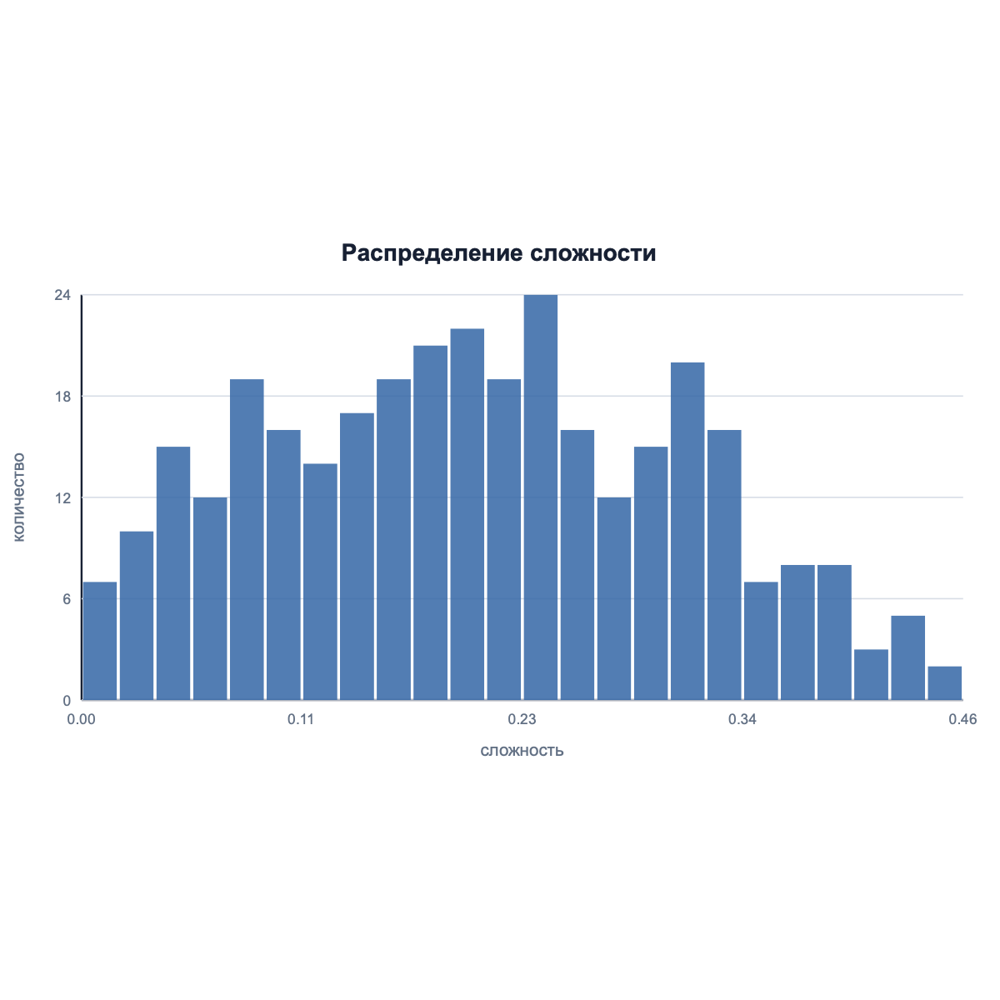

Вывод: `difficulty` является непрерывной величиной с ограниченным диапазоном. Поэтому задача корректно формулируется как регрессия.

### Распределение длины ответа

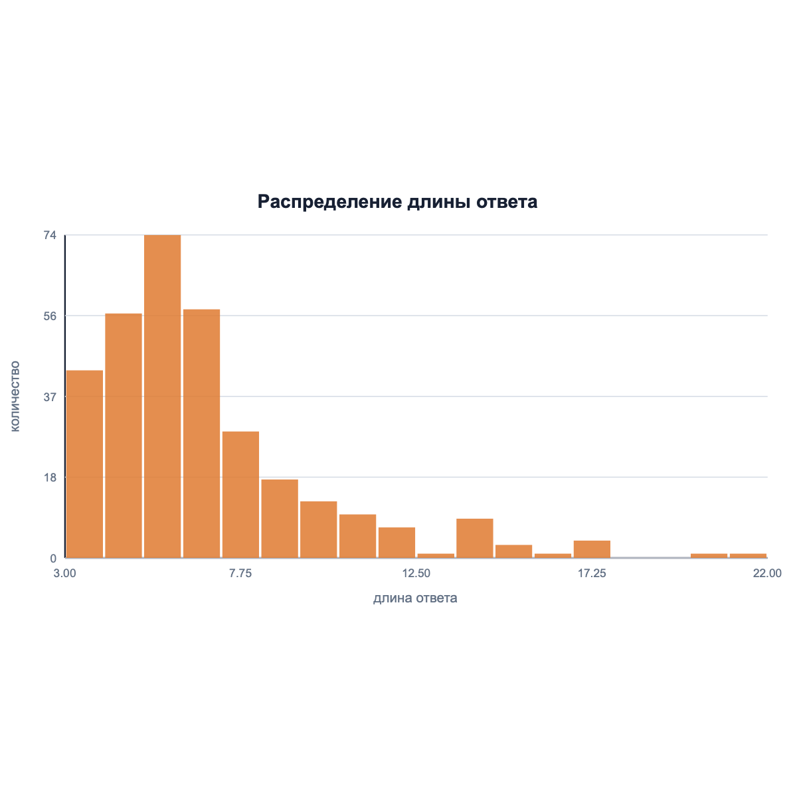

Вывод: большинство ответов короткие. Простые признаки ответа могут быть полезны, но их информативность ограничена.

### Длина описания и сложность

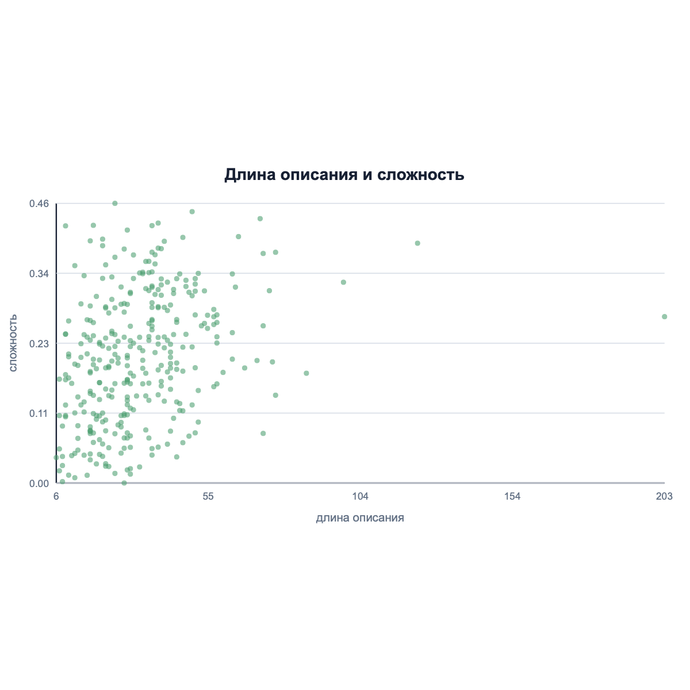

Вывод: более длинное описание может отражать более сложную логику ребуса, но связь не является жесткой. Поэтому одного признака длины описания недостаточно.

### Количество вариантов ответа

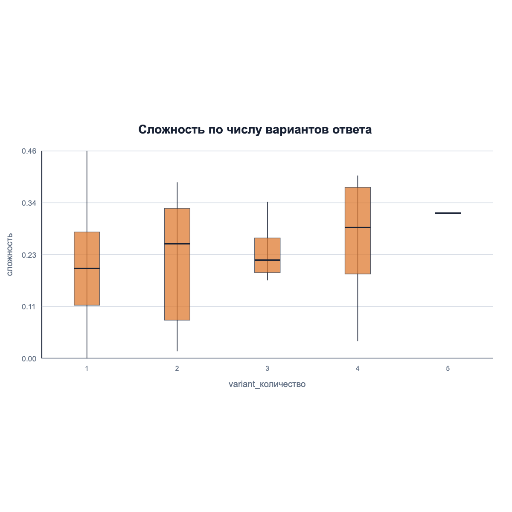

Вывод: наличие нескольких вариантов ответа может быть связано с неоднозначностью ребуса, но этот признак сам по себе не объясняет большую часть сложности.

### Корреляции разрешенных признаков

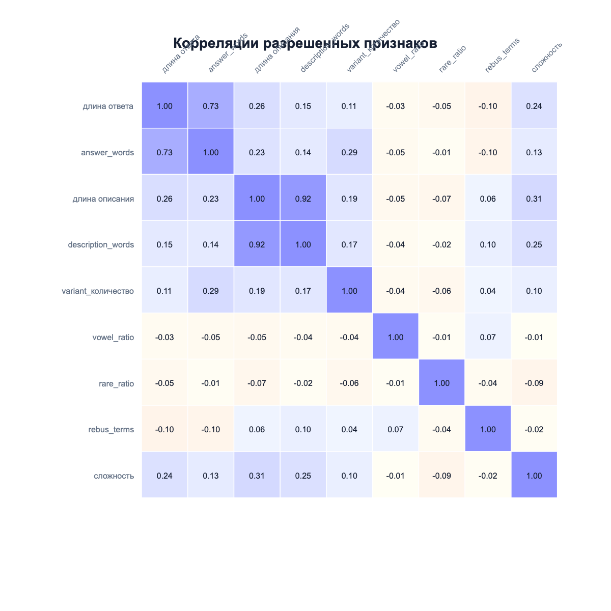

Выводы по EDA:

- простые текстовые признаки имеют слабую или умеренную связь с `difficulty`;
- признаки описания заметно важнее, чем только длина ответа;
- между длиной описания и числом слов в описании ожидаемо высокая корреляция;
- leakage-признаки намеренно исключены;
- нужен сравнительный эксперимент нескольких подходов, а не одна модель на одном наборе признаков.

## Моделирование

В проекте сравниваются пять подходов:

| Подход | Признаки | Цель |
|---|---|---|
| `answer_only` | статистики из `answer` | минимальный текстовый baseline |
| `answer_description` | статистики из `answer` и `description` | проверить вклад описания |
| `nlp` | лемматизация, TF-IDF, char n-grams, rebus logic features | проверить более сильный текстовый подход |
| `efficientnet_only` | только `effnet_feat_*` | проверить, насколько изображение полезно само по себе |
| `nlp_plus_efficientnet` | лучший текстовый подход + EfficientNet | проверить объединение текста и изображения |

Модели:

| Тип | Модели |
|---|---|
| Baseline | `DummyRegressor`, `LinearRegression`, `Ridge` |
| Классические ML | `Lasso`, `ElasticNet`, `SVR`, `KNeighborsRegressor` |
| Ансамбли | `RandomForestRegressor`, `ExtraTreesRegressor`, `GradientBoostingRegressor` |
| Deep learning как extractor | EfficientNet-B0 для изображений |

Код набора числовых моделей:

```python
from sklearn.dummy import DummyRegressor
from sklearn.ensemble import ExtraTreesRegressor, GradientBoostingRegressor
from sklearn.ensemble import RandomForestRegressor
from sklearn.linear_model import ElasticNet, Lasso, LinearRegression, Ridge
from sklearn.neighbors import KNeighborsRegressor
from sklearn.pipeline import Pipeline
from sklearn.preprocessing import StandardScaler
from sklearn.svm import SVR

RANDOM_STATE = 42


def scaled_model(model):
    return Pipeline([("scaler", StandardScaler()), ("model", model)])


def numeric_models() -> dict[str, object]:
    return {
        "dummy_mean": DummyRegressor(strategy="mean"),
        "linear_regression": scaled_model(LinearRegression()),
        "ridge": scaled_model(Ridge(alpha=1.0)),
        "lasso": scaled_model(
            Lasso(alpha=0.001, max_iter=10_000, random_state=RANDOM_STATE)
        ),
        "elastic_net": scaled_model(
            ElasticNet(
                alpha=0.001,
                l1_ratio=0.5,
                max_iter=10_000,
                random_state=RANDOM_STATE,
            )
        ),
        "svr_rbf": scaled_model(SVR(kernel="rbf", C=1.0, epsilon=0.05)),
        "knn_5": scaled_model(KNeighborsRegressor(n_neighbors=5, weights="distance")),
        "random_forest": RandomForestRegressor(
            n_estimators=500,
            max_depth=5,
            min_samples_leaf=5,
            random_state=RANDOM_STATE,
        ),
        "extra_trees": ExtraTreesRegressor(
            n_estimators=500,
            max_depth=5,
            min_samples_leaf=5,
            random_state=RANDOM_STATE,
        ),
        "gradient_boosting": GradientBoostingRegressor(
            n_estimators=200,
            learning_rate=0.03,
            max_depth=2,
            min_samples_leaf=5,
            random_state=RANDOM_STATE,
        ),
    }
```

Код оценки моделей:

```python
import numpy as np
import pandas as pd
from sklearn.metrics import make_scorer, mean_squared_error
from sklearn.model_selection import KFold, cross_validate


def rmse_score(y_true, y_pred) -> float:
    return float(np.sqrt(mean_squared_error(y_true, y_pred)))


def evaluate_models(
    approach_name: str,
    models: dict[str, object],
    X,
    y,
) -> pd.DataFrame:
    cv = KFold(n_splits=5, shuffle=True, random_state=42)
    scoring = {
        "r2": "r2",
        "mae": "neg_mean_absolute_error",
        "rmse": make_scorer(rmse_score, greater_is_better=False),
    }

    rows = []
    for model_name, model in models.items():
        scores = cross_validate(model, X, y, cv=cv, scoring=scoring)
        rows.append(
            {
                "approach": approach_name,
                "model": model_name,
                "r2_mean": scores["test_r2"].mean(),
                "r2_std": scores["test_r2"].std(),
                "mae_mean": -scores["test_mae"].mean(),
                "mae_std": scores["test_mae"].std(),
                "rmse_mean": -scores["test_rmse"].mean(),
                "rmse_std": scores["test_rmse"].std(),
            }
        )

    return pd.DataFrame(rows).sort_values("mae_mean").reset_index(drop=True)
```

## Оценка качества

Основная схема оценки: `5-fold cross-validation`.

Метрики регрессии:

| Метрика | Зачем нужна |
|---|---|
| `MAE` | основная метрика, показывает среднюю абсолютную ошибку |
| `RMSE` | сильнее штрафует крупные ошибки |
| `R2` | показывает долю объясненной дисперсии |

Лучшие модели по каждому подходу:

| Подход | Лучшая модель | CV MAE | CV RMSE | CV R2 |
|---|---:|---:|---:|---:|
| `nlp` | `ridge` | 0.081478 | 0.100347 | 0.082087 |
| `answer_description` | `lasso` | 0.081634 | 0.098047 | 0.124918 |
| `nlp_plus_efficientnet` | `ridge` | 0.081734 | 0.101110 | 0.068428 |
| `answer_only` | `lasso` | 0.087700 | 0.104280 | 0.011490 |
| `efficientnet_only` | `extra_trees_pca` | 0.087742 | 0.105760 | -0.015983 |

### CV MAE по подходам

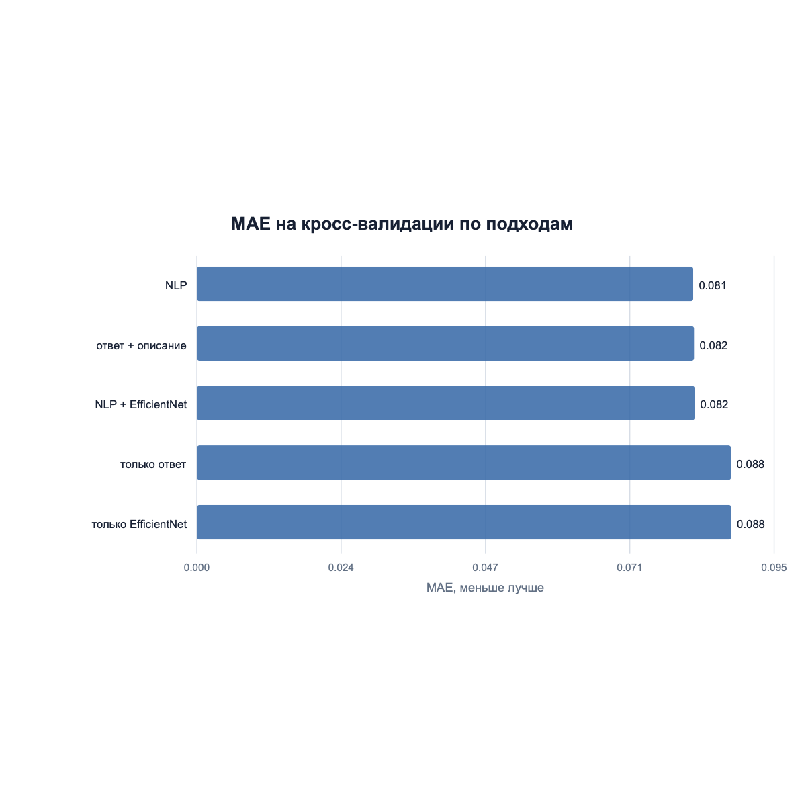

Вывод: по `CV MAE` лучший подход - `nlp`. Подход `answer_description` очень близок, а `nlp_plus_efficientnet` не дает заметного выигрыша на текущем размере датасета.

### CV R2 по подходам

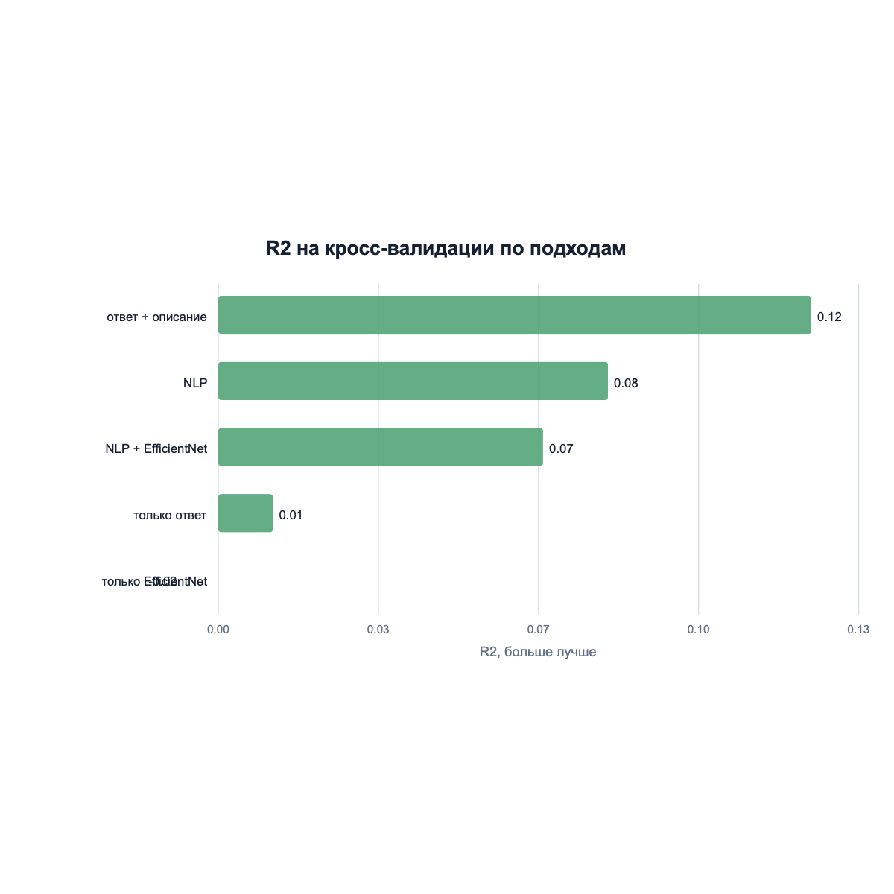

Вывод: значения `R2` невысокие, что ожидаемо для небольшой выборки и субъективной сложности ребусов. Тем не менее текстовые признаки объясняют больше, чем EfficientNet отдельно.

### Сравнение MAE и RMSE

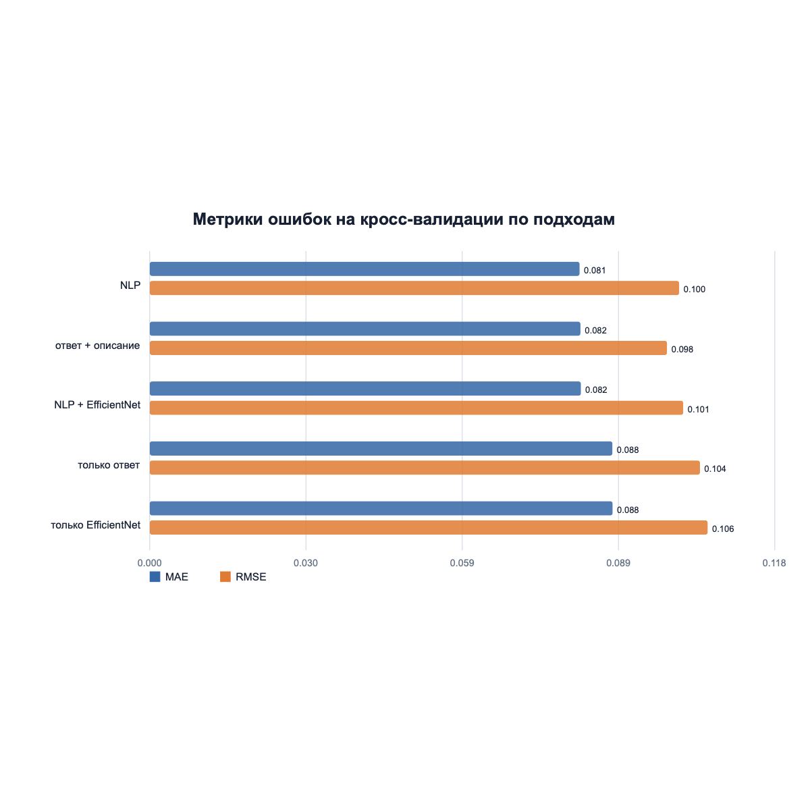

Вывод: `RMSE` выше `MAE`, значит у моделей есть отдельные объекты с более крупными ошибками. Это логично: некоторые ребусы требуют контекста, который плохо извлекается из текста и изображения простыми методами.

### Holdout MAE

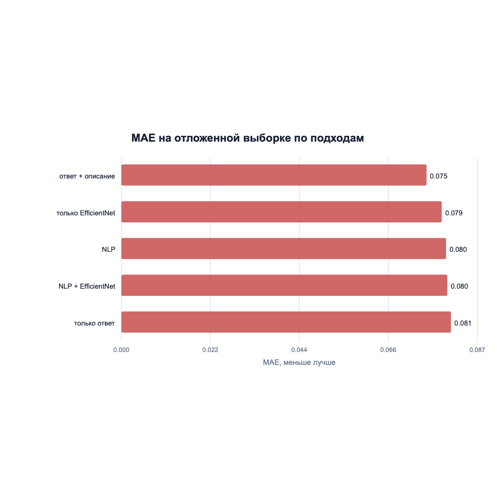

`Holdout` используется как дополнительная проверка после кросс-валидации. Основной критерий выбора моделей остается `CV MAE`.

## Подбор гиперпараметров

Подбор гиперпараметров выполнен для финального пайплайна через `GridSearchCV`.

Подбирались:

- `max_features` для TF-IDF по `description`;
- `max_features` для char n-gram TF-IDF по `answer`;
- число PCA-компонент для EfficientNet-признаков;
- `alpha` для Ridge-регрессии.

Код:

```python
from sklearn.model_selection import GridSearchCV

param_grid = {
    "preprocessor__desc_tfidf__max_features": [300, 500, 800],
    "preprocessor__ans_tfidf__max_features": [200, 300, 500],
    "preprocessor__effnet__pca__n_components": [15, 30, 50],
    "model__alpha": [0.1, 1.0, 10.0, 30.0],
}

grid = GridSearchCV(
    estimator=base_pipeline,
    param_grid=param_grid,
    scoring="neg_mean_absolute_error",
    cv=5,
    n_jobs=-1,
)

grid.fit(X_train, y_train)

print(grid.best_params_)
print(-grid.best_score_)
```

График эффекта подбора:

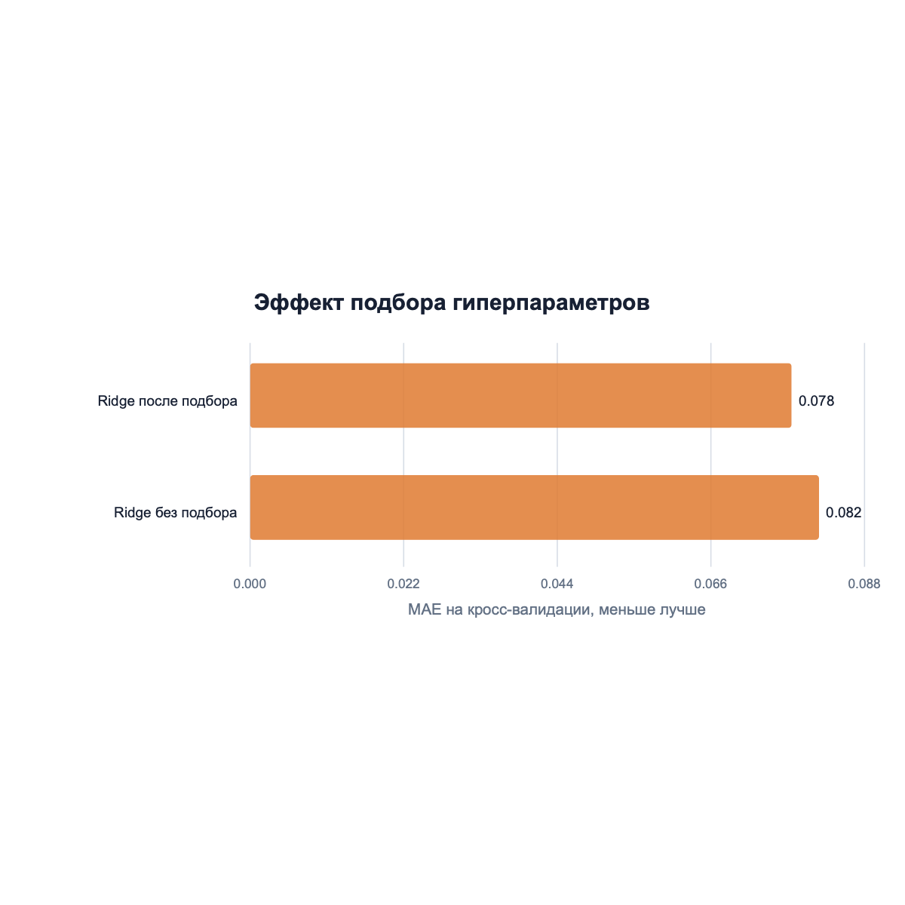

Интерпретация параметров:

| Параметр | Что контролирует |
|---|---|
| `preprocessor__desc_tfidf__max_features` | сколько TF-IDF признаков оставить из описания |
| `preprocessor__ans_tfidf__max_features` | сколько символьных n-грамм оставить из ответа |
| `preprocessor__effnet__pca__n_components` | до какой размерности сжать EfficientNet-признаки |
| `model__alpha` | сила регуляризации Ridge |

## Интерпретация модели

Для интерпретации используется permutation importance. Идея: если перемешать значения важного признака, качество модели заметно ухудшится.

Код:

```python
import pandas as pd
from sklearn.inspection import permutation_importance

importance = permutation_importance(
    final_model,
    X_test,
    y_test,
    n_repeats=20,
    random_state=42,
    scoring="neg_mean_absolute_error",
)

feature_importance = pd.DataFrame(
    {
        "feature": X_test.columns,
        "importance_mean": importance.importances_mean,
        "importance_std": importance.importances_std,
    }
).sort_values("importance_mean", ascending=False)

feature_importance.head(20)
```

График:

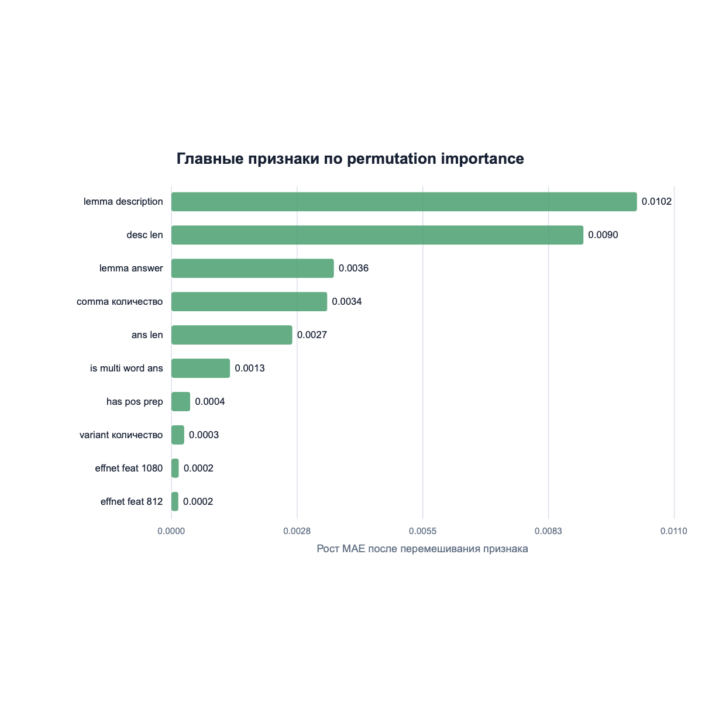

Вывод: наиболее полезные признаки связаны с текстом ответа и описания. EfficientNet-компоненты дают дополнительный сигнал, но на текущем датасете этот сигнал слабее текстового.

## Проверка гипотез

Гипотезы проверяются только на разрешенных признаках, полученных из `answer` и `description`.

Примеры гипотез:

- длина `answer` связана со сложностью;
- длина `description` связана со сложностью;
- несколько вариантов ответа связаны со сложностью;
- наличие rebus-терминов в описании связано со сложностью.

Пример проверки через корреляцию Спирмена:

```python
hyp_df = make_answer_description_features(df)
hyp_df["difficulty"] = df["difficulty"]

h1_corr = hyp_df[["ans_len_chars", "difficulty"]].corr(
    method="spearman"
).iloc[0, 1]

h1_result = (
    "подтверждается"
    if abs(h1_corr) >= 0.2
    else "не получает сильного подтверждения"
)

print(h1_corr)
print(h1_result)
```

Пример проверки групп:

```python
logic_features = df.apply(extract_rebus_logic, axis=1)
hyp_df = pd.concat([logic_features, df[["difficulty"]]], axis=1)

grouped = hyp_df.groupby("has_rebus_terms")["difficulty"].agg(
    ["count", "mean", "median", "std"]
)

print(grouped)
```

Итоговая таблица:

| Гипотеза | Источник признака | Метрика | Значение | Результат |
|---|---|---|---:|---|
| Длина `answer` связана со сложностью | `answer` | Spearman(answer_len, difficulty) | 0.238541 | подтверждается |
| Длина `description` связана со сложностью | `description` | Spearman(description_len, difficulty) | 0.351054 | подтверждается |
| Несколько вариантов `answer` связаны со сложностью | `answer` | difference in mean difficulty | 0.026476 | сильной разницы не видно |
| Rebus-термины в `description` связаны со сложностью | `description` | difference in mean difficulty | -0.007845 | сильной разницы не видно |

Вывод: длина ответа и длина описания имеют умеренную монотонную связь со сложностью. При этом наличие нескольких вариантов ответа и наличие rebus-терминов в описании не показывают заметной разницы в средней сложности.

Важно: поведенческие признаки не участвуют в проверке гипотез, потому что иначе гипотезы фактически проверяли бы формулу сложности.

## Сохранение модели

Итоговая модель сохраняется через `joblib`.

Файлы:

| Файл | Назначение |
|---|---|
| `models/best_text_efficientnet_model.joblib` | сохраненный финальный pipeline |
| `models/best_text_efficientnet_model_metadata.csv` | метаданные сохраненной модели |

Код сохранения:

```python
from pathlib import Path

import joblib
import pandas as pd

MODELS_DIR = Path("models")
MODELS_DIR.mkdir(exist_ok=True)

joblib.dump(
    final_model,
    MODELS_DIR / "best_text_efficientnet_model.joblib",
)

metadata = pd.DataFrame(
    [
        {
            "model_name": "best_text_efficientnet_model",
            "target": "difficulty",
            "main_metric": "MAE",
            "validation": "5-fold CV + holdout",
        }
    ]
)

metadata.to_csv(
    MODELS_DIR / "best_text_efficientnet_model_metadata.csv",
    index=False,
)
```

Код загрузки модели:

```python
import joblib

model = joblib.load("models/best_text_efficientnet_model.joblib")
predictions = model.predict(X_new)
```

## Отчеты и презентация

Отчеты:

| Файл | Назначение |
|---|---|
| `reports/all_model_metrics.csv` | полная таблица метрик всех моделей |
| `reports/best_model_by_approach.csv` | лучшие модели по каждому подходу |

Презентационные материалы:

| Файл | Назначение |
|---|---|
| `presentation/project_presentation.md` | текст и план презентации |
| `presentation/assets/*.svg` | графики в SVG |
| `presentation/assets/*.png` | графики в PNG |

Все графики, используемые в README и презентации:

| График | PNG | SVG |
|---|---|---|
| Формула сложности | `presentation/assets/difficulty_formula.png` | `presentation/assets/difficulty_formula.svg` |
| Распределение сложности | `presentation/assets/difficulty_distribution.png` | `presentation/assets/difficulty_distribution.svg` |
| Распределение длины ответа | `presentation/assets/answer_length_distribution.png` | `presentation/assets/answer_length_distribution.svg` |
| Длина описания и сложность | `presentation/assets/description_len_scatter.png` | `presentation/assets/description_len_scatter.svg` |
| Количество вариантов ответа | `presentation/assets/variant_count_boxplot.png` | `presentation/assets/variant_count_boxplot.svg` |
| Корреляции разрешенных признаков | `presentation/assets/allowed_features_correlation_heatmap.png` | `presentation/assets/allowed_features_correlation_heatmap.svg` |
| CV MAE по подходам | `presentation/assets/cv_mae_by_approach.png` | `presentation/assets/cv_mae_by_approach.svg` |
| CV R2 по подходам | `presentation/assets/cv_r2_by_approach.png` | `presentation/assets/cv_r2_by_approach.svg` |
| CV MAE и RMSE | `presentation/assets/cv_error_metrics_comparison.png` | `presentation/assets/cv_error_metrics_comparison.svg` |
| Holdout MAE | `presentation/assets/holdout_mae_by_approach.png` | `presentation/assets/holdout_mae_by_approach.svg` |
| Эффект подбора гиперпараметров | `presentation/assets/tuning_mae_improvement.png` | `presentation/assets/tuning_mae_improvement.svg` |
| Permutation importance | `presentation/assets/top_permutation_importance.png` | `presentation/assets/top_permutation_importance.svg` |

## Ограничения и дальнейшее развитие

Ограничения:

- датасет небольшой для сложной текстово-визуальной задачи;
- сложность ребуса частично субъективна;
- EfficientNet извлекает визуальные признаки, но не понимает текст внутри изображения;
- в данных отсутствует одно изображение, для него используются нулевые EfficientNet-признаки;
- мультимодальный подход не улучшил качество относительно лучшего NLP-подхода на текущем размере выборки.

Что можно улучшить:

- расширить датасет;
- добавить OCR для чтения текста на изображениях;
- протестировать более сильные мультимодальные эмбеддинги;
- попробовать CatBoost / LightGBM;
- добавить MLflow для трекинга экспериментов;
- провести более глубокий анализ ошибок по типам ребусов.

## Краткий итог

Проект закрывает полный цикл ML-разработки для прикладной задачи: данные, предобработка, feature engineering, EDA, обучение моделей, оценка, подбор гиперпараметров, интерпретация, проверка гипотез и сохранение модели.

Главный результат: на текущих данных лучший подход по `CV MAE` - NLP-модель `Ridge`, обученная на лемматизированном описании, символьных n-граммах ответа и дополнительных признаках логики ребуса.
