# Презентация проекта: ML-модель для оценки сложности ребусов

## Как использовать этот файл

Этот Markdown можно использовать как сценарий презентации: для каждого слайда есть краткий текст на слайд, что показать и что сказать устно. Графики лежат рядом в `presentation/assets/`.

---

## План презентации

| № | Слайд | Основная идея |
|---|---|---|
| 1 | Название проекта | Что решаем и в какой области |
| 2 | Цель проекта | Полный ML-цикл |
| 3 | Постановка задачи | Регрессия, target, допустимые признаки |
| 4 | Формула сложности и leakage | Почему нельзя брать статистики прохождения |
| 5 | Данные | `data.csv`, `data_with_efficientnet_features.csv` |
| 6 | Предобработка и feature engineering | `answer`, `description`, NLP, image features |
| 7 | EDA | Графики и выводы |
| 8 | Проверенные подходы | `answer_only`, `answer_description`, `nlp`, `efficientnet_only`, combined |
| 9 | Модели | Baseline, классические модели, ансамбли |
| 10 | Оценка качества | MAE, RMSE, R2, cross-validation |
| 11 | Подбор гиперпараметров | `GridSearchCV` |
| 12 | Интерпретация | Permutation importance и анализ ошибок |
| 13 | Проверка гипотез | Гипотезы по `answer` и `description` |
| 14 | Итоги | Что сделано |
| 15 | Ограничения и развитие | Что можно улучшить |

---

## Слайд 1. Название проекта

**Текст на слайде**

```text
Разработка и исследование ML-модели
для предсказания сложности ребусов

Предметная область:
IT / цифровые продукты, текстово-визуальные данные

Входные данные:
answer, description, изображение ребуса

Целевая переменная:
difficulty
```

**Что сказать**

В проекте решается прикладная задача предсказания сложности ребуса. Мы используем текстовые данные: ответ и описание логики ребуса, а также изображение самого ребуса. Цель - построить модель, которая оценивает сложность без использования статистики прохождения, потому что она напрямую участвует в формуле целевой переменной.

---

## Слайд 2. Цель проекта

**Текст на слайде**

```text
Цель:
построить и обосновать ML-модель,
которая предсказывает difficulty ребуса
по его содержанию.

Полный цикл:
данные -> предобработка -> модели -> оценка ->
интерпретация -> сохранение модели
```

**Что сказать**

Основная цель - не просто обучить одну модель, а пройти полный ML-пайплайн: изучить данные, подготовить признаки, сравнить несколько подходов, выбрать лучший, интерпретировать результат и сохранить итоговую модель.

---

## Слайд 3. Постановка задачи

**Текст на слайде**

```text
Тип задачи: регрессия

Target:
difficulty

Разрешенные источники признаков:
answer
description
image features

Запрещенные признаки:
started, solved, hints, solve_rate и производные
```

**Что сказать**

Задача формулируется как регрессия, потому что `difficulty` - числовая величина. Важное ограничение: мы не используем статистику прохождения ребуса, например количество начавших, решивших и использовавших подсказки. Эти признаки запрещены, потому что из них напрямую рассчитывается целевая переменная.

---

## Слайд 4. Формула сложности и leakage

**Текст на слайде**

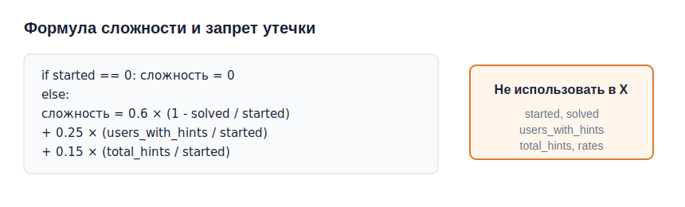

**Пример кода**

```python
def calculate_difficulty(frame):
    started = frame["started"].replace(0, np.nan)
    calculated = (
        0.6 * (1 - frame["solved"] / started)
        + 0.25 * (frame["users_with_hints"] / started)
        + 0.15 * (frame["total_hints"] / started)
    )
    return calculated.fillna(0)
```

**Что сказать**

Сложность уже вычисляется по формуле из поведенческих данных. Поэтому использование этих колонок привело бы к утечке данных: модель просто восстановила бы формулу, а не научилась бы оценивать сам ребус. Поэтому `started`, `solved`, `users_with_hints`, `total_hints`, `solve_rate`, `hint_usage`, `avg_hints` исключены из признаков.

---

## Слайд 5. Данные

**Текст на слайде**

```text
Исходный датасет:
data.csv

Основные поля:
answer
description
img_url
difficulty

Датасет с image features:
data_with_efficientnet_features.csv
```

**Пример кода**

```python
DATA_PATH = Path("../data.csv")
df = pd.read_csv(DATA_PATH)

ALLOWED_RAW_INPUTS = ["answer", "description", "img_url"]
TARGET = "difficulty"

LEAKAGE_COLUMNS = [
    "started",
    "solved",
    "users_with_hints",
    "total_hints",
    "solve_rate",
    "hint_usage",
    "avg_hints",
]
```

**Что сказать**

Исходный датасет содержит ответы, описания, пути к изображениям и целевую переменную. Для визуального подхода был сформирован отдельный датасет с признаками EfficientNet-B0. Служебные статистики остаются только для проверки формулы `difficulty`, но не используются при обучении.

---

## Слайд 6. Предобработка и Feature Engineering

**Текст на слайде**

```text
answer:
длина, число слов, гласные, редкие буквы,
уникальные символы, наличие цифр

description:
длина, число слов, текстовые признаки

NLP:
лемматизация
TF-IDF по description
char n-grams по answer

image:
EfficientNet-B0 embeddings
PCA внутри Pipeline
```

**Пример кода**

```python
def extract_text_stats(text, prefix=""):
    text = str(text).lower().strip()
    if "|" in text:
        text = text.split("|")[0].strip()

    compact = text.replace(" ", "")
    words = [word for word in text.split() if word]

    return pd.Series({
        f"{prefix}len_chars": len(compact),
        f"{prefix}len_words": len(words),
        f"{prefix}avg_word_len": len(compact) / len(words) if words else 0.0,
        f"{prefix}has_digits": int(any(char.isdigit() for char in text)),
    })
```

**Что сказать**

Для `answer` и `description` были созданы простые интерпретируемые признаки. Для более сложной текстовой обработки использовался NLP-подход: лемматизация, TF-IDF для описания и символьные n-граммы для ответа. Для изображений использовались эмбеддинги EfficientNet-B0, которые затем сжимались через PCA внутри пайплайна.

---

## Слайд 7. EDA

**Текст на слайде**

```text
EDA включал:

1. распределение difficulty
2. распределение длины answer
3. answer_len vs difficulty
4. description_len vs difficulty
5. variant_count vs difficulty
6. корреляции разрешенных признаков
```

**Графики**

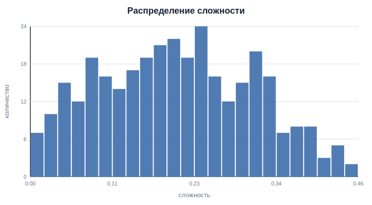

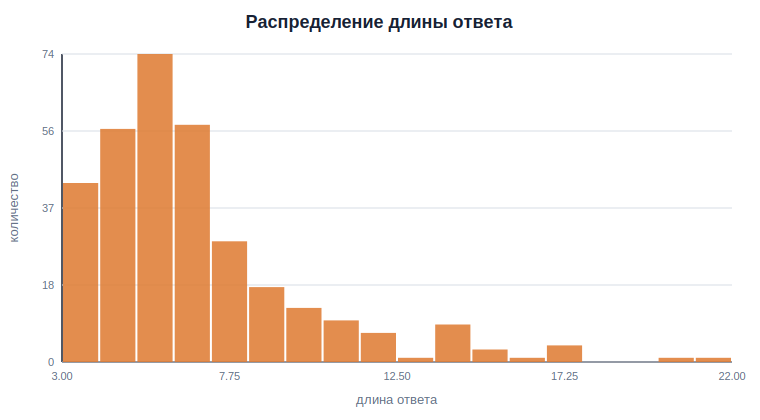

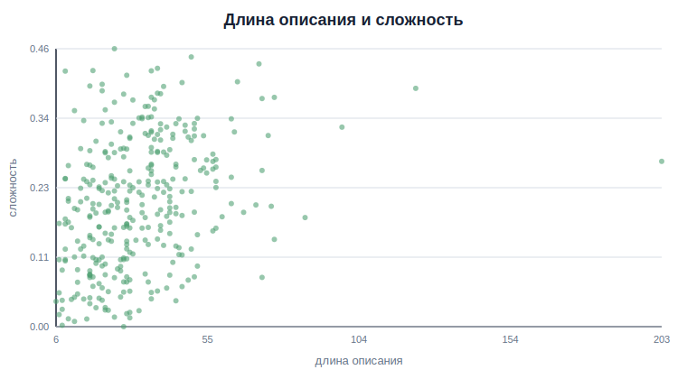

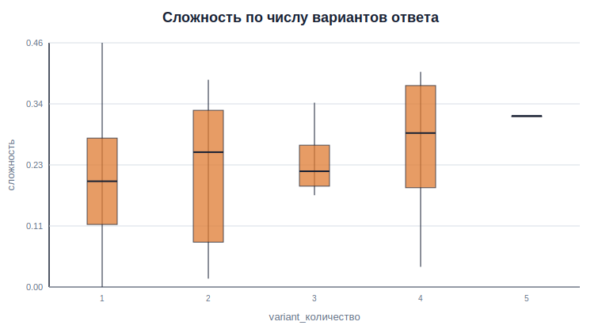

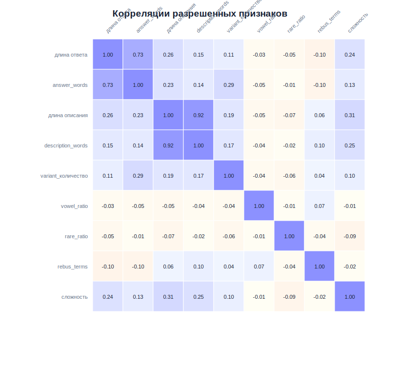

**Что сказать**

В EDA анализировались только разрешенные признаки, то есть производные от `answer` и `description`. Поведенческие признаки намеренно исключены. Основной вывод: простые текстовые признаки имеют ограниченную связь со сложностью, поэтому дополнительно были проверены NLP и признаки изображений.

---

## Слайд 8. Проверенные подходы

**Текст на слайде**

```text
1. answer_only
2. answer + description
3. NLP
4. EfficientNet-only
5. лучший текстовый подход + EfficientNet
```

**Пример кода**

```python
text_approaches = {
    "answer_only": {
        "X": answer_features,
        "models": numeric_models(),
    },
    "answer_description": {
        "X": all_text_features,
        "models": numeric_models(),
    },
    "nlp": {
        "X": X_nlp,
        "models": nlp_models,
    },
}
```

**Что сказать**

Мы сравнили несколько вариантов признакового пространства. Сначала проверили только ответ, затем ответ вместе с описанием, потом NLP-подход, отдельно признаки изображения и финально мультимодальный подход: лучший текстовый вариант плюс EfficientNet.

---

## Слайд 9. Модели

**Текст на слайде**

```text
Baseline:
DummyRegressor
LinearRegression
Ridge

Классические модели:
Lasso
ElasticNet
SVR
KNN

Ансамбли:
RandomForest
ExtraTrees
GradientBoosting
```

**Пример кода**

```python
models = {
    "dummy_mean": DummyRegressor(strategy="mean"),
    "linear_regression": scaled_model(LinearRegression()),
    "ridge": scaled_model(Ridge(alpha=1.0)),
    "lasso": scaled_model(Lasso(alpha=0.001, max_iter=10_000)),
    "svr_rbf": scaled_model(SVR(kernel="rbf")),
    "random_forest": RandomForestRegressor(n_estimators=500),
    "extra_trees": ExtraTreesRegressor(n_estimators=500),
    "gradient_boosting": GradientBoostingRegressor(),
}
```

**Что сказать**

Для каждого подхода сравнивались baseline-модели, классические регрессоры и ансамблевые модели. Основной критерий выбора - MAE на 5-fold cross-validation. Дополнительно считались RMSE и R2.

---

## Слайд 10. Оценка качества

**Текст на слайде**

```text
Метрики регрессии:

MAE — основная метрика
RMSE — штрафует крупные ошибки
R2 — доля объясненной дисперсии

Основной способ оценки:
5-fold cross-validation
```

**Пример кода**

```python
cv = KFold(n_splits=5, shuffle=True, random_state=42)
scoring = {
    "r2": "r2",
    "mae": "neg_mean_absolute_error",
    "rmse": make_scorer(rmse_score, greater_is_better=False),
}

scores = cross_validate(model, X, y, cv=cv, scoring=scoring)
```

**Графики**

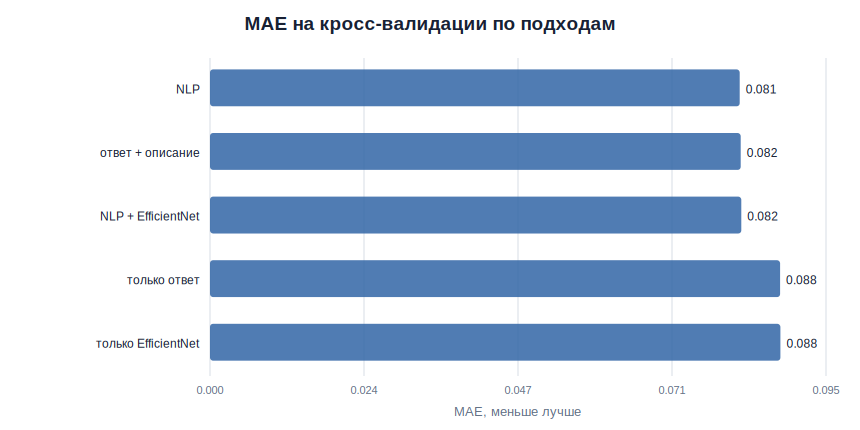

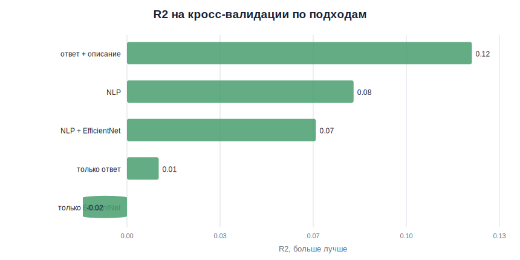

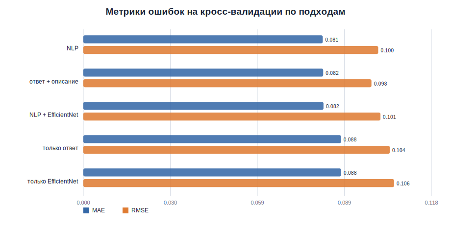

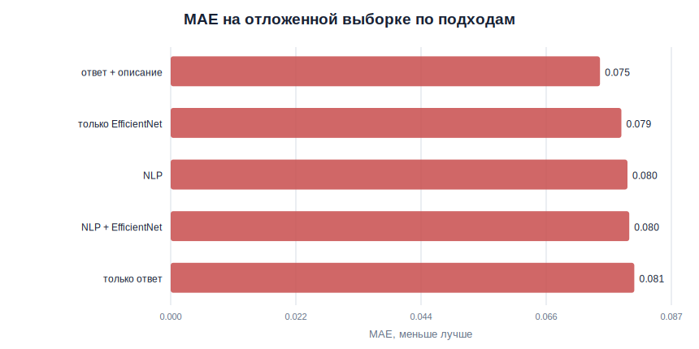

**Что сказать**

Так как задача регрессии, использовались MAE, RMSE и R2. Основной метрикой выбран MAE, потому что она напрямую показывает среднюю ошибку предсказания сложности. Для выбора моделей использовалась кросс-валидация, а holdout применялся как дополнительная проверка. На графиках видно, что текстовые подходы дают основной вклад: NLP и `answer + description` близки по качеству, а EfficientNet сам по себе слабее на этом размере датасета.

---

## Слайд 11. Подбор гиперпараметров

**Текст на слайде**

```text
GridSearchCV для финального pipeline

Подбирались:
TF-IDF max_features для description
char n-gram max_features для answer
число PCA-компонент EfficientNet
alpha для Ridge
```

**Пример кода**

```python
param_grid = {
    "preprocessor__desc_tfidf__max_features": [300, 500, 800],
    "preprocessor__ans_tfidf__max_features": [200, 300, 500],
    "preprocessor__effnet__pca__n_components": [15, 30, 50],
    "model__alpha": [0.1, 1.0, 10.0, 30.0],
}

grid = GridSearchCV(
    estimator=base_pipeline,
    param_grid=param_grid,
    scoring="neg_mean_absolute_error",
    cv=5,
)
```

**График**

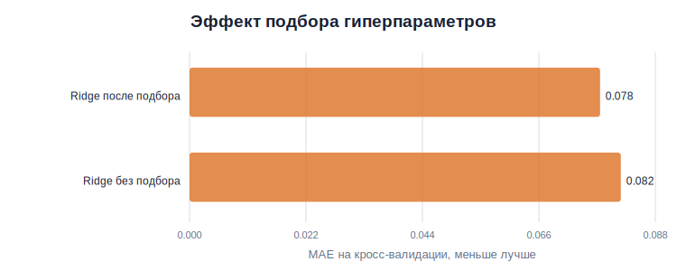

**Что сказать**

Для лучшего итогового пайплайна был выполнен подбор гиперпараметров. Подбиралось количество TF-IDF признаков, число PCA-компонент для изображений и регуляризация Ridge. Это позволяет не выбирать параметры вручную, а найти их по кросс-валидации. В сохраненном прогоне tuning снизил CV MAE по сравнению с дефолтным Ridge.

---

## Слайд 12. Интерпретация

**Текст на слайде**

```text
Интерпретация:

Permutation importance
анализ ошибок
сравнение фактической и предсказанной difficulty

Цель:
понять, какие признаки реально влияют на прогноз
```

**Пример кода**

```python
importance = permutation_importance(
    final_model,
    X_test,
    y_test,
    n_repeats=20,
    random_state=42,
    scoring="neg_mean_absolute_error",
)

feature_importance = pd.DataFrame({
    "feature": X.columns,
    "importance_mean": importance.importances_mean,
})
```

**График**

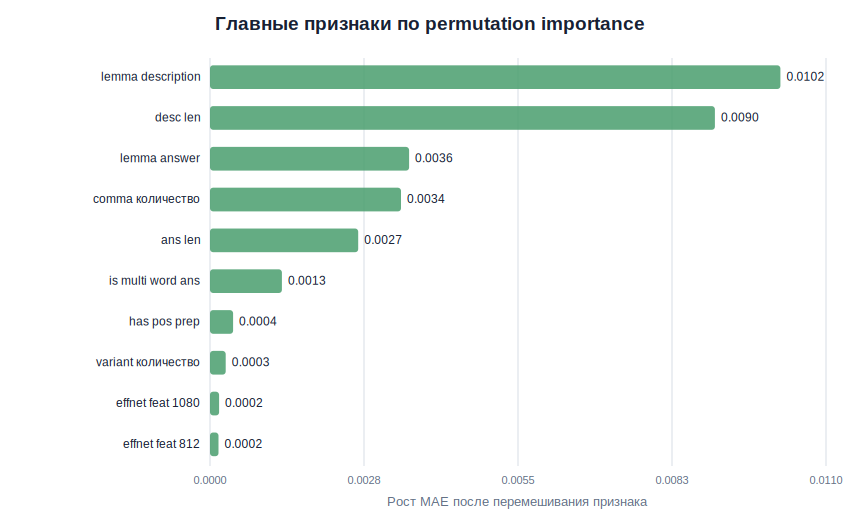

**Что сказать**

Для интерпретации использовалась permutation importance. Она показывает, насколько ухудшается качество модели при перемешивании конкретного признака. По результатам важнее всего оказались признаки из описания и ответа, а отдельные EfficientNet-компоненты дают меньший, но ненулевой вклад. Также анализировались объекты с наибольшей ошибкой, чтобы понять, где модели не хватает информации.

---

## Слайд 13. Проверка гипотез

**Текст на слайде**

```text
Проверялись гипотезы:

длина answer связана со сложностью
длина description связана со сложностью
несколько вариантов answer связаны со сложностью
rebus-термины в description связаны со сложностью
```

**Пример кода**

```python
h1_corr = hyp_df[["answer_len", "difficulty"]].corr(
    method="spearman"
).iloc[0, 1]

h1_result = (
    "подтверждается"
    if abs(h1_corr) >= 0.2
    else "не получает сильного подтверждения"
)
```

**Что сказать**

Гипотезы проверялись только на разрешенных признаках: `answer` и `description`. Поведенческие признаки не использовались. Это важно, потому что иначе гипотезы фактически проверяли бы формулу сложности, а не свойства ребуса.

---

## Слайд 14. Итоги

**Текст на слайде**

```text
Что сделано:

проверена формула difficulty
исключены leakage-признаки
построены текстовые, NLP и image-подходы
сравнены модели по MAE, RMSE, R2
выполнен подбор гиперпараметров
получена интерпретация модели
модель сохранена
```

**Что сказать**

В результате был построен корректный ML-проект без утечки данных. Модель обучается не на статистике прохождения, а на содержании ребуса: ответе, описании и изображении. Проект покрывает основные этапы ТЗ: данные, предобработка, EDA, моделирование, оценка, tuning, интерпретация, гипотезы и сохранение модели.

---

## Слайд 15. Ограничения и развитие

**Текст на слайде**

```text
Ограничения:

небольшой размер датасета
сложность ребуса частично субъективна
изображения не всегда полностью объясняют логику
один файл изображения отсутствует

Что можно улучшить:

увеличить датасет
использовать OCR
добавить multimodal embeddings
протестировать CatBoost / LightGBM
добавить MLflow
```

**Что сказать**

Основное ограничение - небольшой размер датасета и сложность самой задачи: ребусы часто требуют культурного контекста, игры слов и визуальной логики. В дальнейшем можно улучшить проект за счет OCR, более сильных мультимодальных эмбеддингов и расширения датасета.

